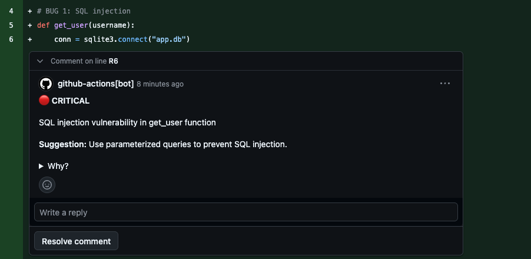
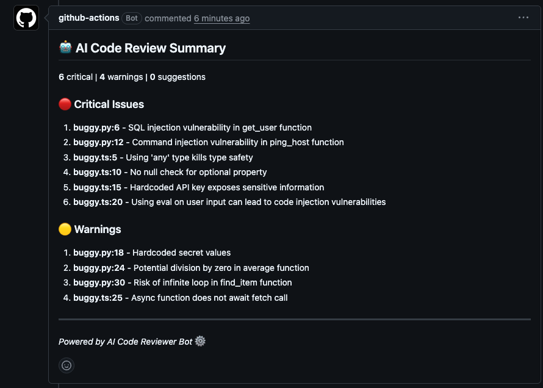

# AI Code Reviewer Bot

Automatic AI code review on every pull request. No API keys. No cost. Powered by GitHub Models.

## How it works

When you open a PR, the bot reviews every changed file and posts inline comments for bugs, security issues, and bad practices. PRs with critical issues fail the check.

## Setup — 1 step

Copy this file into your repository at `.github/workflows/review.yml`:

```yaml
name: AI Code Review

on:
  pull_request:
    types: [opened, synchronize, reopened]
    paths-ignore:
      - "**.md"
      - "docs/**"
      - ".gitignore"

permissions:
  pull-requests: write
  contents: read
  models: read

jobs:
  review:
    runs-on: ubuntu-latest

    steps:
      - name: Checkout code
        uses: actions/checkout@v4
        with:
          fetch-depth: 0

      - name: Setup Node.js
        uses: actions/setup-node@v4
        with:
          node-version: "18"

      - name: Install dependencies
        run: npm ci

      - name: Run AI Code Review
        env:
          GITHUB_TOKEN: ${{ secrets.GITHUB_TOKEN }}
          GITHUB_REPOSITORY: ${{ github.repository }}
          GITHUB_EVENT_PATH: ${{ github.event_path }}
        run: node src/index.js

      - name: Comment on failure
        if: failure()
        uses: actions/github-script@v7
        with:
          script: |
            github.rest.issues.createComment({
              issue_number: context.issue.number,
              owner: context.repo.owner,
              repo: context.repo.repo,
              body: '⚠️ AI Code Review encountered an error. Check the [workflow logs](https://github.com/${{ github.repository }}/actions/runs/${{ github.run_id }}).'
            })
```

That's it. No secrets, no tokens, no billing.

## Example





## What it detects

| Severity | Examples |
|----------|---------|
| 🔴 Critical | SQL injection, XSS, `eval()`, hardcoded credentials, null dereference, division by zero |
| 🟡 Warning | Memory leaks, race conditions, missing error handling, performance issues |
| 💡 Suggestion | Code style, naming, best practices |

## Languages supported

JavaScript, TypeScript, Python, Java, Go, PHP, Ruby, C, C++, and more. Skips lock files, minified files, images, and docs.

## Blocking merges on critical issues

To prevent merging PRs with critical bugs:

1. Go to **Settings → Branches → Add branch protection rule**
2. Set branch name pattern to `main`
3. Enable **Require status checks to pass before merging**
4. Add `AI Code Review / review`

> Requires GitHub Pro for private repositories. Works for free on public repositories.

## Requirements

- GitHub repository (public or private)
- GitHub Actions enabled
- Node.js 18+
